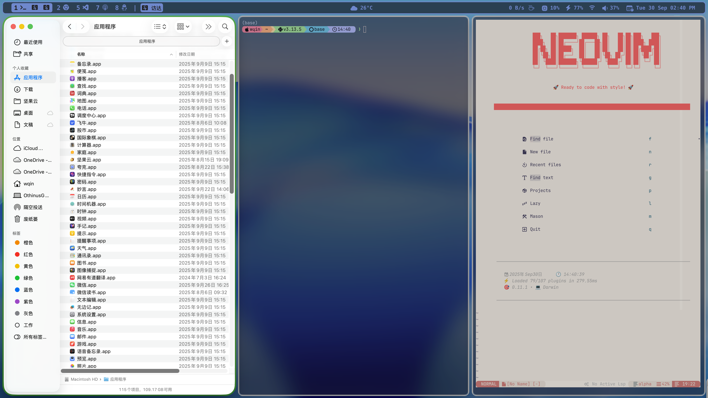
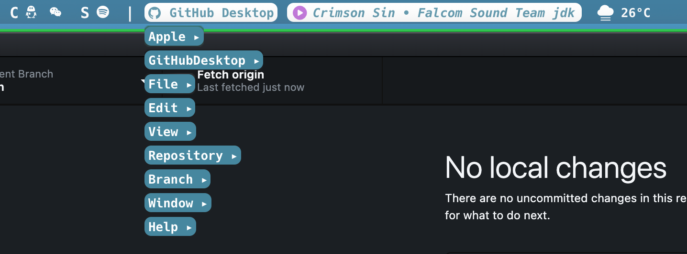

# mac-dotfiles-aerospace

## AeroSpace + SketchyBar + Ghostty + Starship + Neovim

#### [中文](README_CN.md) | [English](README.md)

这是我长期自用并持续迭代的一套 macOS dotfiles。

主题与交互仍然以 **macOS 原生视觉、低干扰、键盘优先、窗口自动归位和终端工作流** 为核心。

绝大部分配置都参考或整合自社区中的优秀项目，我主要根据自己的使用习惯进行了修改、精简和重新组合。最终目标没有改变：

> **打造一个简洁、高效、可预测，并尽量减少操作打断的 macOS 工作环境。**




---

## Major Update — 2026.09

1. AeroSpace 启动后同时拉起 JankyBorders

2. Ghostty 成为当前主力终端

3. SketchyBar

## 4. Native macOS App Menu


**点击当前 App 标签，可以直接弹出当前应用的 macOS 原生菜单。**



支持：

- 一级菜单
- 子菜单
- disabled menu item
- 点击执行原生菜单命令
- mouse exit 自动关闭

因此即使隐藏 macOS 原生菜单栏，也仍然可以通过 SketchyBar 使用当前应用菜单。

如果要隐藏原生 menu bar：

```text
System Settings
→ Control Center
→ Automatically hide and show the menu bar
→ Always
```

---

## 5. Music Control

原 README 中的音乐控制逻辑继续保留。

| 操作 | 功能 |
| --- | --- |
| 左键点击 | 播放 / 暂停 |
| 右键点击 | 下一曲 |
| `Ctrl + 右键点击` | 上一曲 |

Current active player:

```text
Apple Music
```

`plugins/now_playing.sh` 中仍保留 Spotify 和 MPD / `rmpc` 的支持代码。

如果要切换到 Spotify，可在：

```text
~/.config/sketchybar/plugins/now_playing.sh
```

停用：

```bash
get_apple_music_info
process_player_info
```

并启用：

```bash
get_spotify_info
process_player_info
```

6. YouTube Music

仓库仍保留独立的 YouTube Music item / plugin。

客户端：

https://github.com/th-ch/youtube-music

启用 API Server 后，可把 `sketchybarrc` 中：

```bash
source "$ITEM_DIR/now_playing.sh"
```

替换为：

```bash
source "$ITEM_DIR/youtube-music.sh"
```

YouTube Music 不属于默认启用项，因此不会加入最小 Homebrew 安装列表。

---

 7. Weather

当前默认：

```bash
script="$PLUGIN_DIR/weather_baidu.sh"
```

同时保留：

```text
Baidu Weather
NMC
Open-Meteo
```

修改：

```text
~/.config/sketchybar/settings.sh
```

例如：

```bash
WEATHER_BAIDU_QUERY="上海闵行天气"
WEATHER_BAIDU_SRCID="4982"
```

NMC：

```bash
WEATHER_NMC_STATIONID="HIieJ"
```

Open-Meteo：

```bash
WEATHER_METEO_LATITUDE=30.2416
WEATHER_METEO_LONGITUDE=120.1189
```

---

## 8. 新增Reminders插件

当前 Reminders widget 读取：

```text
Inbox
```

并显示一个未完成任务。

`Ctrl + Left Click`：

```text
完成当前显示的 Reminder
```

`Ctrl + Right Click`：

```text
打开 Reminders.app
```

---

 9. App Icons

Homebrew 已提供：

```bash
brew install --cask font-sketchybar-app-font
```

---

# Installation

## 0. System prerequisites

建议先安装 Xcode Command Line Tools：

```bash
xcode-select --install
```

它提供 Git、Clang 等 macOS 开发工具，也避免为了 Neovim / Tree-sitter 再额外安装完整 GCC 工具链。

SketchyBar / AeroSpace 使用前请确保：

```text
System Settings
→ Desktop & Dock
→ Displays have separate Spaces
```

处于开启状态。

---

## 1. Install  from Homebrew

```bash
/bin/bash -c "$(curl -fsSL https://raw.githubusercontent.com/Homebrew/install/HEAD/install.sh)"
```

### Formulae

```bash
brew tap FelixKratz/formulae

brew install \
  sketchybar \
  borders \
  jq \
  starship \
  zsh-syntax-highlighting \
  zsh-autosuggestions \
  zsh-completions
```

### Casks / Fonts

```bash
brew install --cask \
  nikitabobko/tap/aerospace \
  ghostty \
  font-hack-nerd-font \
  font-jetbrains-mono-nerd-font \
  font-sketchybar-app-font \
  sf-symbols
```

### Optional: Karabiner

只有使用 Hyper Layer 时才需要：

```bash
brew install --cask karabiner-elements
```

---

### Optional: Neovim

仓库包含完整 Neovim 配置。

最低安装：

```bash
brew install neovim
```

如果要完整使用当前 Neovim 配置中的 Telescope、native fzf extension 和 Markdown Preview，建议额外安装：

```bash
brew install \
  fd \
  ripgrep \
  cmake \
  node \
  yarn
```

## 2. Clone
**记得提前备份。**

```bash
git clone https://github.com/OthinusG/mac-dotfiles.git ~/mac-dotfiles && \
rm -rf ~/.config && \
cp -R ~/mac-dotfiles/.config ~/.config && \
cp ~/mac-dotfiles/.aerospace.toml ~/.aerospace.toml && \
cp ~/mac-dotfiles/.zshrc ~/.zshrc && \
cp ~/mac-dotfiles/.zprofile ~/.zprofile
```


---

# Start

## SketchyBar

```bash
brew services start sketchybar
```

重新加载：

```bash
sketchybar --reload
```

---

## AeroSpace

配置中已经：

```toml
start-at-login = true
```

正常启动 AeroSpace.app 后即可。

AeroSpace 会自动运行：

```text
borders
```

---

# Per-machine Settings

复制配置后至少检查以下项目。

---

## 1. Display names

`.aerospace.toml` 中存在：

```text
HDMI2.1
PHL 288E2
```

检查自己机器：

```bash
aerospace list-monitors
```

然后修改：

```toml
[gaps]
outer.top = [
  { monitor."YOUR DISPLAY" = 3 },
  3
]
```

---

## 2. Network interface

当前：

```bash
INTERFACE="en1"
```

文件：

```text
~/.config/sketchybar/plugins/network_rates.sh
```

检查：

```bash
networksetup -listallhardwareports
```

根据实际情况修改为：

```text
en0
en1
...
```

---

## 3. Weather

文件：

```text
~/.config/sketchybar/settings.sh
```

修改：

```bash
WEATHER_BAIDU_QUERY
WEATHER_BAIDU_SRCID
WEATHER_NMC_STATIONID
WEATHER_METEO_LATITUDE
WEATHER_METEO_LONGITUDE
```

---

## 4. Proxy

`.zshrc` 当前代理端口：

```text
127.0.0.1:7897
```

如果 Clash / Shadowrocket / Mihomo 使用其他端口，需要修改：

```bash
proxy() {
    ...
}
```

---

# References / Credits

感谢以下项目和配置作者：

- [AeroSpace](https://github.com/nikitabobko/AeroSpace)
- [SketchyBar](https://github.com/FelixKratz/SketchyBar)
- [JankyBorders](https://github.com/FelixKratz/JankyBorders)
- [Ghostty](https://ghostty.org/)
- [Starship](https://starship.rs/)
- [Herdr](https://herdr.dev/)
- [sketchybar-app-font](https://github.com/kvndrsslr/sketchybar-app-font)
- [QianSong1/wezterm-config](https://github.com/QianSong1/wezterm-config)
- [clear668866x6/nvim](https://github.com/clear668866x6/nvim)
- [patricorgi/dotfiles](https://github.com/patricorgi/dotfiles)
- [manishprivet/.dotfiles](https://github.com/manishprivet/.dotfiles)
- [sergii-dudar/dotfiles](https://github.com/sergii-dudar/dotfiles)
- [Sinjhin/SketchyMenu](https://github.com/Sinjhin/SketchyMenu)
- [th-ch/youtube-music](https://github.com/th-ch/youtube-music)

Original reference video:

https://www.youtube.com/watch?v=e34qllePuoc

---

## Disclaimer

These are personal dotfiles, not a plug-and-play macOS distribution.

Some settings are intentionally opinionated and hardware-specific. Read the configuration before copying it and keep only the parts that fit your own workflow.

```

---

## 2. Network interface

当前：

```bash
INTERFACE="en1"
```

文件：

```text
~/.config/sketchybar/plugins/network_rates.sh
```

检查：

```bash
networksetup -listallhardwareports
```

根据实际情况修改为：

```text
en0
en1
...
```

---

## 3. Weather

文件：

```text
~/.config/sketchybar/settings.sh
```

修改：

```bash
WEATHER_BAIDU_QUERY
WEATHER_BAIDU_SRCID
WEATHER_NMC_STATIONID
WEATHER_METEO_LATITUDE
WEATHER_METEO_LONGITUDE
```

---

## 4. Proxy

`.zshrc` 当前代理端口：

```text
127.0.0.1:7897
```

如果 Clash / Shadowrocket / Mihomo 使用其他端口，需要修改：

```bash
proxy() {
    ...
}
```

---

# References / Credits

感谢以下项目和配置作者：

- [AeroSpace](https://github.com/nikitabobko/AeroSpace)
- [SketchyBar](https://github.com/FelixKratz/SketchyBar)
- [JankyBorders](https://github.com/FelixKratz/JankyBorders)
- [Ghostty](https://ghostty.org/)
- [Starship](https://starship.rs/)
- [Herdr](https://herdr.dev/)
- [sketchybar-app-font](https://github.com/kvndrsslr/sketchybar-app-font)
- [QianSong1/wezterm-config](https://github.com/QianSong1/wezterm-config)
- [clear668866x6/nvim](https://github.com/clear668866x6/nvim)
- [patricorgi/dotfiles](https://github.com/patricorgi/dotfiles)
- [manishprivet/.dotfiles](https://github.com/manishprivet/.dotfiles)
- [sergii-dudar/dotfiles](https://github.com/sergii-dudar/dotfiles)
- [Sinjhin/SketchyMenu](https://github.com/Sinjhin/SketchyMenu)
- [th-ch/youtube-music](https://github.com/th-ch/youtube-music)

Original reference video:

https://www.youtube.com/watch?v=e34qllePuoc

---

## Disclaimer

These are personal dotfiles, not a plug-and-play macOS distribution.

Some settings are intentionally opinionated and hardware-specific. Read the configuration before copying it and keep only the parts that fit your own workflow.
